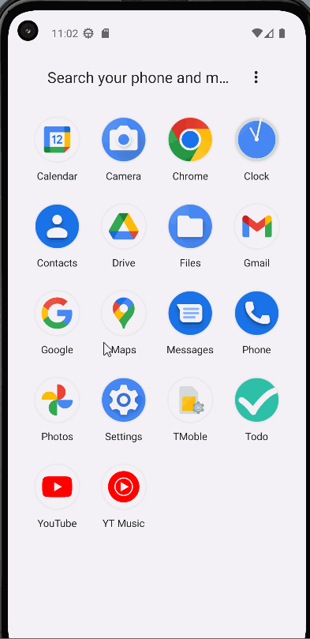
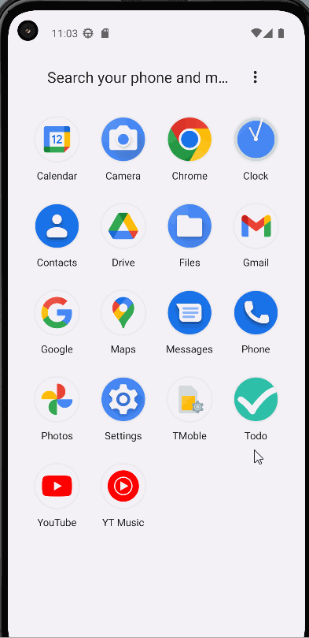
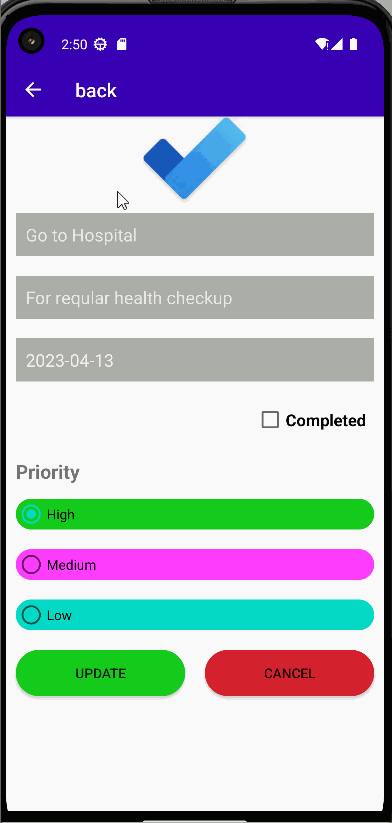
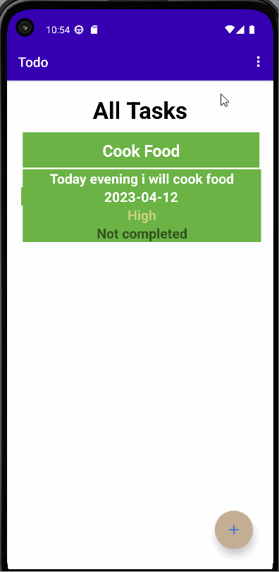
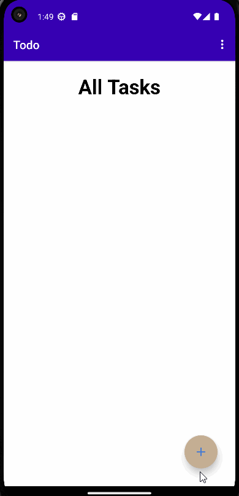
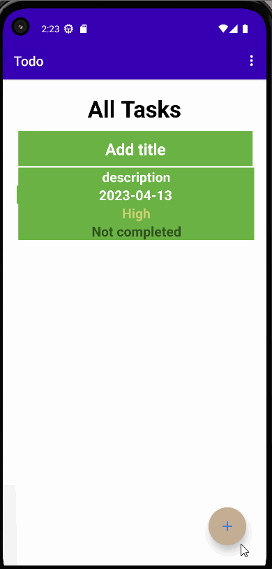
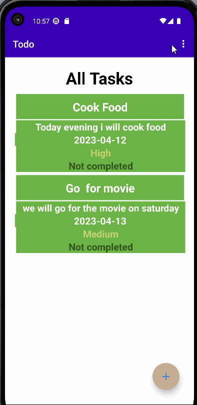
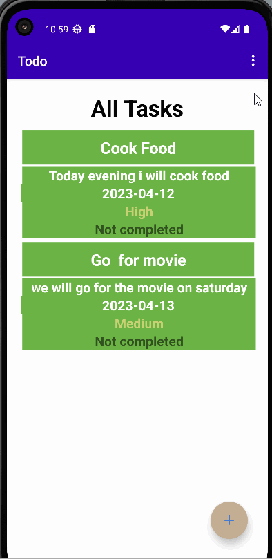

# ToDo App 

A todo app  written in java using the fragments,Components,MVVM and persistance
A user may add task to todo task list,update the tasks as per their requirement, view all the tasks they have completed or not completed as well as ,Share their notes via bluetooth,gmail and delete all the tasks or only the completed task.This app  helps  user to record their daily activities.

## UI Of ToDo App

### Icon Launcher  

 This is Icon Launcher of my ToDo App where user can see the Icon of our APP while installing.
 
 

### Splash Screen 

 This is Splash Screeen of ToDo App where user can see the Logo of our APP befoe landing on the home page.
 
 

### Navigation
   User can navigate through one activity to another by using the back button present on the second activity.
  
  

### Menu 

  Here, I have added  some of the options in a menu such as delete, share and exit. It helps to  perform certain actions.
  

### Add Task 

  In this section, user can add task by filling title,description ,selecting date and priority of the task as well as choose the status and click on the save button. 
  

### Update Task

  In this section user can easily update task by changing title,description ,selecting date and priority of the task as well as choose the status and click on the save button.In addition to, users can cancel the updation and go back on  the home.
  

### Delete Completed Task Only

  In case of the task deletion, user can easily delete tasks that are already completed.
 

### Delete All Task
 
  In case to delete all the task at once, user can easily complete his needs by using delete menu option.
  

### Share Task
 Users can share their notes or task through the gmail or bluetooth  by selecting the share option in menu.
 

### About us 
 Users can see the details of the App and author name in this section.
 

### Exit App

 In this last section, user can exit the app by clicking on the exit menu located in menu option of the app.

In this TodDo Application i have divided features into

## Features

- Splash Screen befoe the MainActivity
- Simple to addd task 
- Easy to Navigate 
- View Status of the task
- displays task with priority
- Easy to share note /task

## Author

- [Raban Kathariya](https://www.github.com/raban2/)

## References
- [Binay Shah](https://github.com/binay-shah/TodoMVVM.git)

 

