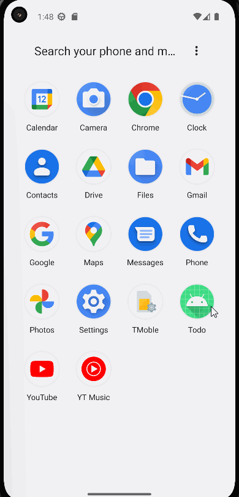
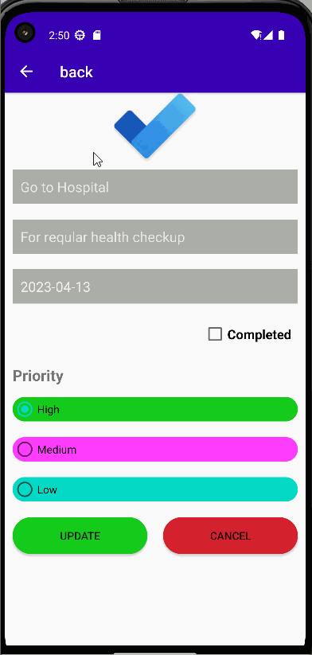
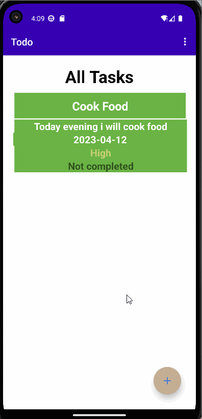
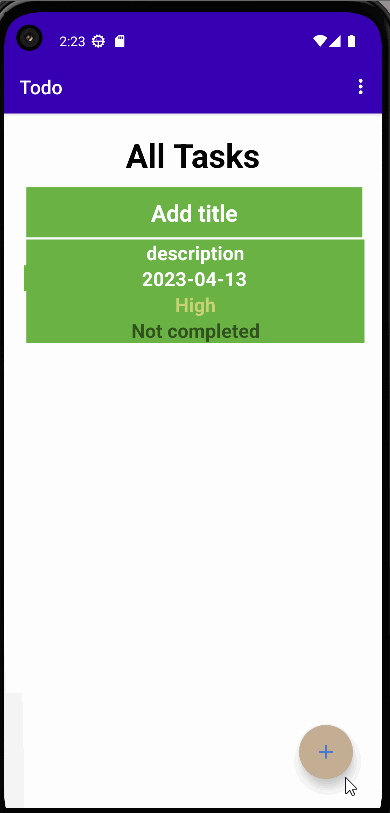
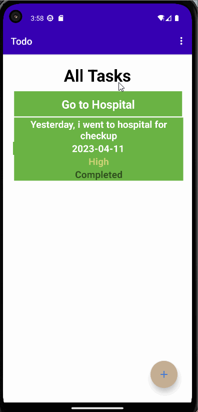
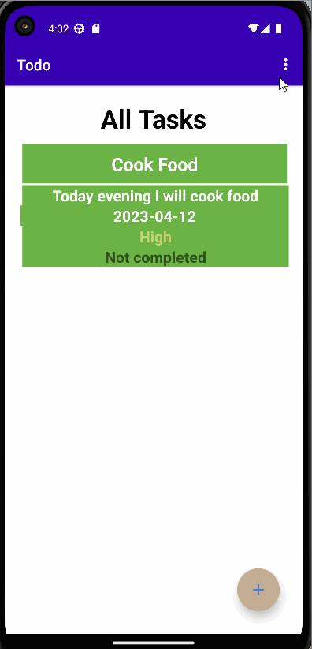
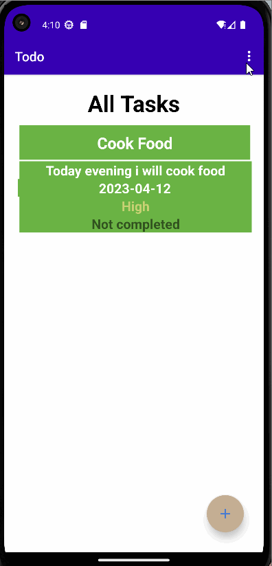

# ToDo App 

A todo app  written in java using the fragements,RoomDatabase.
A user may add task to todo task list,update the tasks as per their requirement, view all the tasks they have completed or not completed as well as ,Share their notes via bluetooth,gmail and delete all the tasks or only the completed task.

## UI Of ToDo App
### Splash Screen 

### Add_Navigation

### Menu

### Add Task

### Update Task

### Delete Completed Task Only

### Delete All Task

### Share Task

### Exit App

## Features

- Splash Screen befoe the MainActivity
- Add task easily
- Easy to Navigate 
- Easy to share notelist
- View Status of the task
- displays task with priority

## Author

- [Raban Kathariya](https://www.github.com/raban2/)

