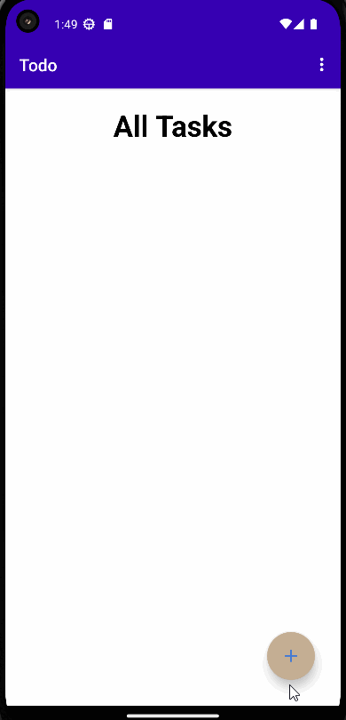

# ToDo App 

A todo app  written in java using the fragements,RoomDatabase.
A user may add task to todo task list,update the tasks as per their requirement, view all the tasks they have completed or not completed as well as ,Share their notes via bluetooth,gmail and delete all the tasks or only the completed task.

## UI Of ToDo App
### Splash Screen 

 This is Splash Screeen of ToDo App where user can see the Logo of our APP befoe landing on the home of the page.
 
 

### Navigation
   User can navigate through one activity to another by using the back  button present on the second activity
  
  

### Menu 

  Here, I have added  some of the options in a menu such as delete,exit and share
  

### Add Task 

  In this section user can add task by filling title,description ,aselecting date and priority of the task as well as choose the status and click onthe save button. 
  

### Update Task

  In this section user can easily update  task by changing title,description ,electing date and priority of the task as well as choose the status and click onthe save button.In addition to, users can cancel the updation and go back on  the home.
  

### Delete Completed Task Only

  In case of the task deletion , user can easily delete tasks that are already completed.
 

### Delete All Task
 
  In case to delete all the task at once, user can easily delete  by using delete menu option.
  

### Share Task
 Users can share their notes or task  through the gmail or  bluetooth easily by selecting the share option in menu.
 

### Exit App

 In this last section, user can exit the app by clicking on the exit menu located in Menu option of the app

## Features

- Splash Screen befoe the MainActivity
- Simple to addd task 
- Easy to Navigate 
- View Status of the task
- displays task with priority
- Easy to share note /task

## Author

- [Raban Kathariya](https://www.github.com/raban2/)

